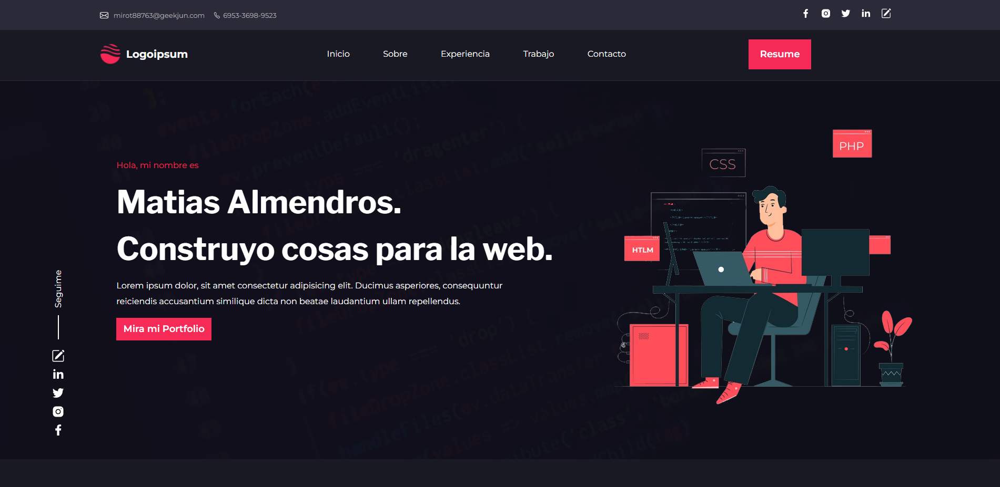
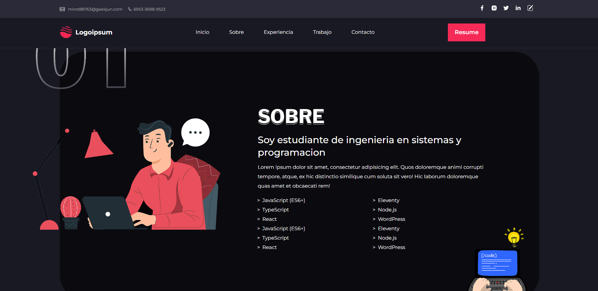
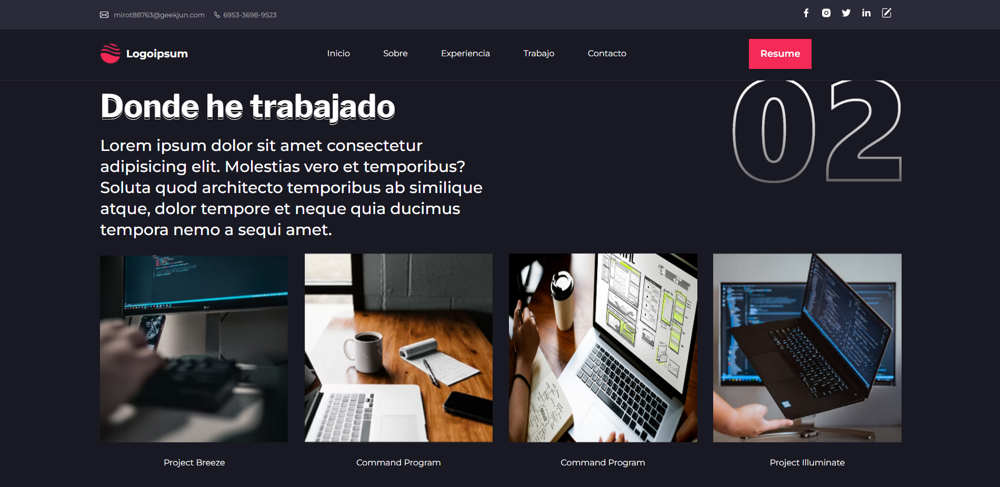
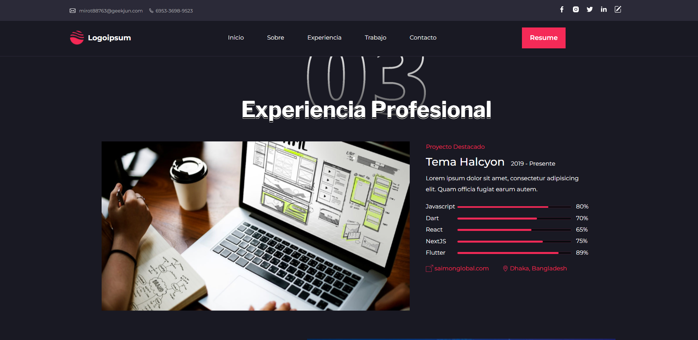
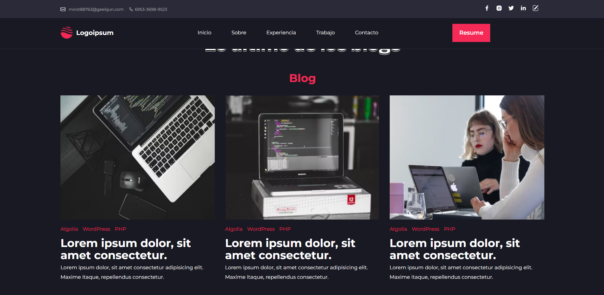
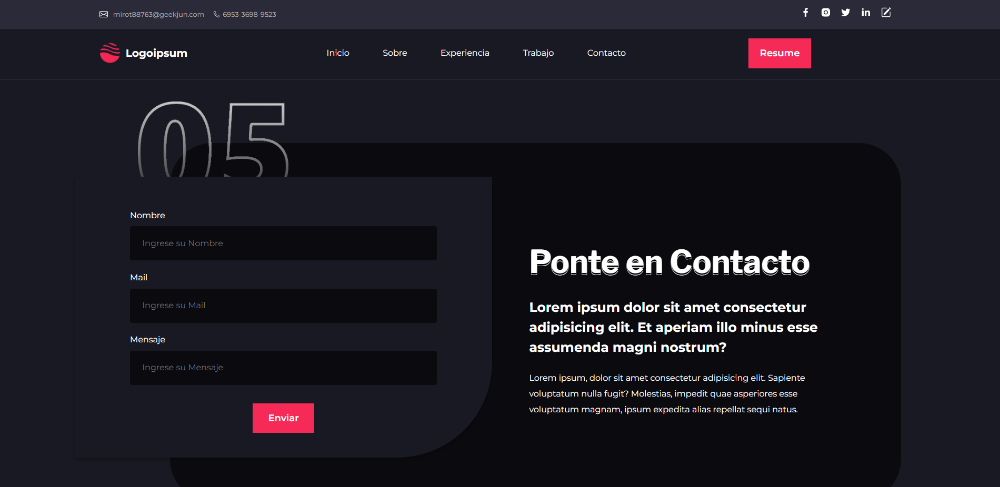

[]
# Portfolio Web Personal

Este repositorio contiene el código fuente de mi portafolio web personal, diseñado para mostrar mi trabajo y habilidades. Inspirado en [este diseño](https://www.behance.net/gallery/165732117/Personal-Portfolio-Web-UI?tracking_source=search_projects%7Cportfolio+web&l=62).

## Descripción

Este proyecto es un portafolio web personal que en un futuro va a presentar mi información, habilidades y proyectos. Aunque actualmente no tengo proyectos para mostrar o no tengo un amplio dominio de lenguajes de programación, he creado esta página web para tener una base lista que pueda personalizar posteriormente con mis propios datos y proyectos.

## Uso

Para ver mi portafolio web, simplemente visita el siguiente enlace: [Portafolio Web](https://matiasalmendros.github.io/Portfolio-Web/)

## Capturas de Pantalla

## Tecnologías Utilizadas

- HTML
- CSS

## Proyectos Futuros

Planeo agregar más funcionalidades a mi portafolio en el futuro, incluyendo:
- Sección de proyectos destacados
- Integración con servicios de alojamiento de archivos para mostrar archivos
- Incorporación de un formulario de contacto

¡Gracias por visitar mi repositorio!
